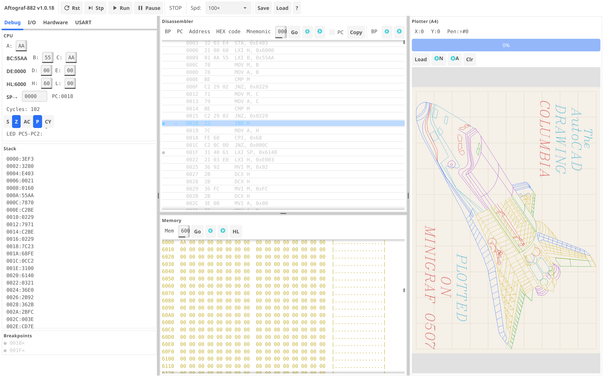
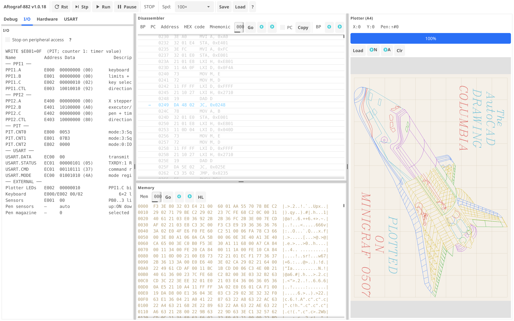

# Autograf-882 Debug Simulator v1.0.18


*Le traceur original Autograf-882*

## Fonctionnalités

### Émulation CPU (Rust & Go)
- Émulation complète du K580IK80A / Intel 8080 — les 256 opcodes
- Registres : A, B, C, D, E, H, L, SP, PC (éditables en hex)
- Drapeaux : S, Z, AC, P, CY (cliquables)
- Interruptions (INTR avec vecteur RST 7)
- Compteur de cycles dans le panneau CPU
- Multiplicateur de vitesse : 1x/10x/100x/1Kx/10Kx/100Kx (Go)

### Mémoire
- ROM : 24 Ko à `$0000–$5FFF` (trois D2764A)
- RAM : 2 Ko à `$6000–$67FF` (K537RU10)
- Entrées-sorties mappées : PPI1 à `$E000`, PPI2 à `$E400`, PIT à `$E800`, USART à `$EC00`

### Désassembleur (Rust & Go)
- Basé sur la table d'opcodes du CPU
- Breakpoints (clic pour activer/désactiver)
- **Follow PC** — instruction centrée
- Barre de recherche + navigation ◀▶
- Clic sur une adresse → saut dans le visualiseur mémoire
- Copie de la plage visible dans le presse-papiers (Go)

### Visualiseur Mémoire (Rust & Go)
- 32 lignes × 16 octets = 512 o visibles (Go) ; 64 lignes (Rust)
- Navigation : barre d'adresse, Go, ◀▶, bouton HL
- Clic sur BC:/DE:/HL:/SP: — saut à l'adresse
- Code couleur : ROM (brun), RAM (or), I/O (violet) — Go
- Édition d'octets par clic (Entrée pour valider)
- Colonne ASCII à droite

### Périphériques (Rust & Go)
- **K580VV55A (PPI8255)** : deux puces, 3 ports + registre de contrôle
- **K580VI53 (PIT8253)** : 3 compteurs 16 bits
- **K580VV51A (USART8251)** : tampons RX/TX, envoi hex, journal

### Traceur (Rust & Go)
- Moteurs pas à pas XY simulés depuis les phases PPI
- 7 couleurs de stylo
- Toile A4 avec mise à l'échelle automatique
- Chargement de fichiers HPGL, exécution pas à pas

### HPGL
- Commandes : IN, SP, PU, PD, PA, PR
- Mode aperçu : dessiner tous les segments
- Mode pas à pas : ▶ Suivant / ▶▶ Tout / ⟲ Réinitialiser
- Barre de progression

### Terminal USART (Go)
- Champ de saisie hexadécimale pour envoi au CPU
- Journal de réception (20 dernières entrées)
- Indicateurs TXRDY/RXRDY

### Interface Go : matériel en direct et débogage E/S
- L'onglet `Debug` regroupe CPU, pile et points d'arrêt
- L'onglet `I/O` affiche PPI1/PPI2, PIT, USART et le matériel externe en colonnes
- L'onglet `Hardware` contient une matrice clavier 6×2, quatre fins de course X/Y, quatre entrées DIP et les LED PPI1.C2–C5
- Les touches, fins de course et DIP peuvent être modifiés pendant l'exécution du CPU
- `Stop on peripheral access` arrête Go après une instruction utilisant PPI, PIT ou USART
- La ligne d'événement indique `READ/WRITE`, l'adresse ou le port direct, la valeur, le périphérique et la fonction du registre
- Le bouton `?` de l'onglet I/O explique la carte des adresses des périphériques





### Diagnostics
- Panneau CPU avec compteur de cycles
- Pile (8 mots en Go)
- LED du traceur sur PPI1.C2–C5 (Go)
- Simulation du clavier 6×2, des fins de course X/Y et des entrées DIP (Go)
- Sauvegarde/chargement de session en JSON (Go)
- Raccourcis clavier : Espace/→ pas, R réinitialisation, F5 marche/pause, B breakpoint, ? aide

## Compilation et exécution

### Rust (version principale)

```bash
cd rust
cargo run --release
```

Tests :

```bash
cd rust
cargo test -- --test-threads=1
```

### Go (en développement actif)

```bash
cd go
./trygo.sh
```

`trygo.sh` compile l'interface, exécute les tests unitaires et le smoke-test GUI, puis démarre le simulateur. Pour un lancement direct : `go run ./cmd/aftograf`. La version Go utilise Fyne v2.5 et nécessite un serveur d'affichage (X11/macOS/Wayland).

Tests :

```bash
cd go
go test -count=1 ./...
go test -race ./pkg/app
go vet ./...
```

### Version navigateur

`sim/` — ancienne version pour navigateur :

Version actuelle du navigateur : `v0.0.7`.

```bash
cd sim && ./tryjs.sh
# Ou manuellement :
python3 -m http.server 8080
# Ouvrir http://localhost:8080/sim/
```

`tryjs.sh` reconstruit le bundle, exécute les tests de régression HPGL pour `PU/PD`, `PA` et `PR`, puis démarre le serveur local.

## Structure du projet

```
├── rust/                  ← Version principale (Rust)
│   ├── Cargo.toml
│   └── src/ (cpu, memory, disasm, plotter, hpgl, ppi8255, pit8253, usart8251, settings, session)
├── go/                    ← Version Go (Fyne)
│   ├── go.mod / go.sum
│   ├── cmd/aftograf/main.go
│   └── pkg/ (app, cpu, memory, disasm, plotter, hpgl, ppi8255, pit8253, usart8251, settings)
├── sim/                   ← Version navigateur
├── docs/                  ← Documentation
└── images/                ← Captures d'écran
```

## Raccourcis clavier

| Touche | Action |
|--------|--------|
| `Espace` / `→` | Pas |
| `R` | Réinitialisation CPU |
| `F5` | Marche / Pause |
| `B` | Breakpoint |
| `?` | Aide |

Dans l'onglet Go `I/O`, activez `Stop on peripheral access` pour arrêter après l'instruction qui lit ou écrit un périphérique. La description du dernier accès reste visible.

---

**Autres langues :** [English](README.md) · [Русский](README.RU.md) · [Português](README.PT.md) · [Українська](README.UA.md) · [Français](README.FR.md) · [Deutsch](README.DE.md)
