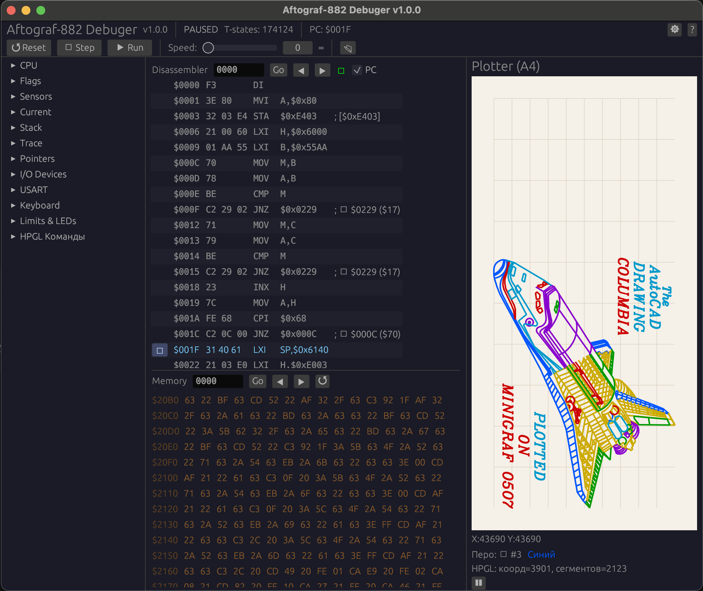

# Autograf-882 Debug Simulator v1.0.10


*Le traceur original Autograf-882*

## Fonctionnalités

### Émulation CPU
- Émulation complète du K580IK80A / Intel 8080 — les 256 opcodes
- Registres : A, B, C, D, E, H, L, SP, PC (éditables)
- Drapeaux : S, Z, AC, P, CY
- Interruptions (INTR avec vecteur RST)
- Compteur de cycles dans le panneau CPU

### Mémoire
- ROM : 24 Ko à `$0000–$5FFF` (trois D2764A)
- RAM : 2 Ko à `$6000–$67FF` (K537RU10)
- Entrées-sorties mappées : PPI1 à `$E000`, PIT à `$E800`, USART à `$EC00`

### Désassembleur
- 256 instructions par écran, accès complet à 64 Ko
- **Follow PC** — instruction courante toujours centrée
- Recherche par adresse, boutons ◀▶
- Clic pour points d'arrêt

### Visualisateur Mémoire
- 64 lignes × 16 octets = 1 Ko visible
- Navigation : barre d'adresse + Go, ◀▶, HL
- Édition inline par double-clic
- Colonne ASCII à droite

### HPGL
- Commandes : IN, SP, PU, PD, PA, PR
- **Aperçu** : dessiner le fichier complet
- **Mode pas à pas** : ▶ Next / ▶▶ All / ⟲ Reset
- **Dessiner jusqu'à N** : saisir le numéro de segment
- Barre de progression, ligne active surlignée


*Simulateur débogueur en action (Rust/egui)*


## Compilation et Exécution

```bash
cd rust
cargo run --release
```

### Tests

```bash
cd rust
cargo test -- --test-threads=1
```

### Version Navigateur

```bash
python3 -m http.server 8080
# Ouvrez http://localhost:8080/sim/
```


*Simulateur débogueur pour navigateur (JavaScript)*


## Structure du Projet

```
├── rust/                  ← Version principale (Rust)
│   ├── Cargo.toml
│   ├── TESTS.md
│   └── src/
│       ├── main.rs
│       ├── app.rs
│       ├── cpu.rs
│       ├── memory.rs
│       ├── disasm.rs
│       ├── plotter.rs
│       ├── hpgl.rs
│       ├── ppi8255.rs
│       ├── pit8253.rs
│       ├── usart8251.rs
│       ├── settings.rs
│       └── session.rs
├── sim/                   ← Version navigateur
└── docs/                  ← Documentation
```

---

**Autres langues :** [English](README.md) · [Русский](README.RU.md) · [Português](README.PT.md) · [Українська](README.UA.md) · [Français](README.FR.md) · [Deutsch](README.DE.md)
