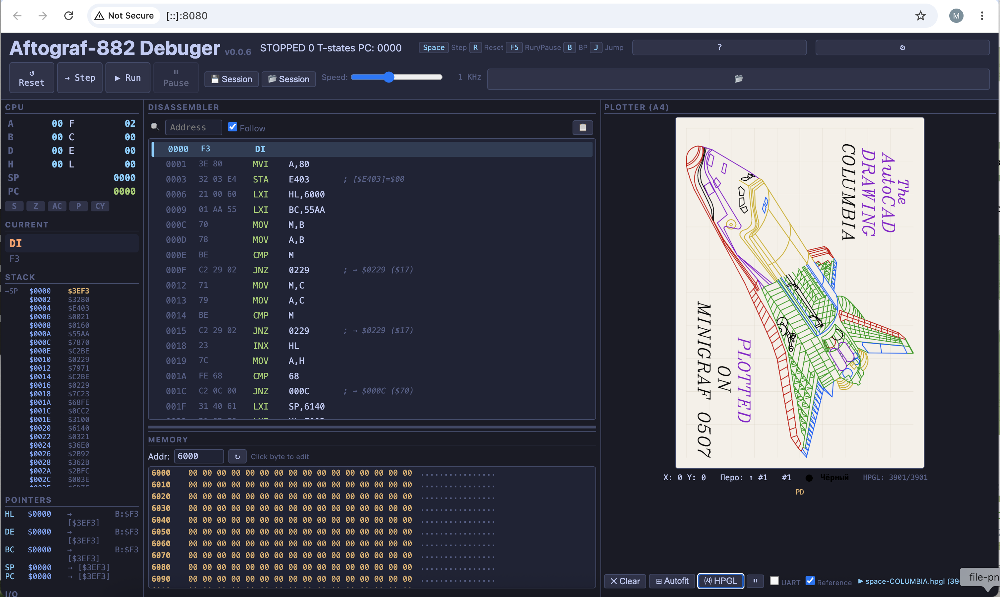

# Simulador Debugger Autograf-882



Um depurador e simulador interativo baseado em navegador para o **Autograf-882** — um plotter de mesa soviético construído em torno da CPU **K580IK80A** (um clone do Intel 8080).

Este projeto fornece um gêmeo digital completo do hardware original: emulação de CPU, E/S mapeada em memória, desmontador, simulação de plotter, terminal USART e carregador de arquivos HPGL — tudo executado no navegador sem lógica de servidor.

## Funcionalidades

### Emulação de CPU (cpu8080.js)
- Emulação completa do K580IK80A / Intel 8080 — todos os 256 opcodes
- Registradores: A, B, C, D, E, H, L, SP, PC
- Flags: S, Z, AC, P, CY (posições de bit 8080)
- Tratamento de interrupções (INTR com vetor RST)
- Contagem de ciclos T-state
- Controle de velocidade: máxima (ilimitada) até 100 Hz

### Memória (memory.js)
- ROM: 24 KB em `$0000–$5FFF` (três EPROMs D2764A)
- RAM: 1 KB em `$6000–$63FF` (KR537RU10)
- E/S mapeada em memória: PPI1 em `$E000`, PPI2 em `$E400`, PIT em `$E800`, USART em `$EC00`
- Leituras não mapeadas retornam `$FF`; escritas em ROM/não mapeado são registradas

### Desmontador
- Desmontador híbrido recursivo-linear baseado na tabela de opcodes da CPU
- 6 colunas: breakpoint, endereço, bytes, mnemônico, operandos, anotação
- Modo Follow-PC destaca a instrução atual
- Rolagem virtual de todos os 64 KB de espaço de endereço
- Clique para alternar breakpoints, clique duplo para saltar PC
- Busca por endereço (tecla `J` salta para a linha sob o cursor)
- Copiar intervalo visível para a área de transferência

### Visualizador de Memória
- Dump com rolagem virtual de todos os 64 KB
- Regiões codificadas por cores: ROM (cinza), RAM (amarelo), E/S (violeta)
- Edição inline de bytes — clique no byte, edite em hex, Tab para o próximo
- Destaque do ponteiro HL com marcador laranja
- Barra de endereço para navegação rápida

### Simulação do Plotter
- Simulação de motores de passo XY a partir das fases da porta PPI
- 7 cores de caneta (da análise do firmware)
- Canvas A4 retrato (proporção 1:√2) com suporte Retina
- Grade com escala automática, cursor de posição atual
- Botões de limpar canvas e ajuste automático

### Carregador HPGL
- Carregar arquivos HPGL: comandos `IN`, `SP`, `PU`, `PD`
- **Modo direto**: analisar e desenhar no canvas com animação
- **Modo UART**: enviar texto HPGL caractere por caractere para o USART
- Indicador de progresso e pausa/retomar

### Terminal USART
- Campo de entrada hexadecimal para enviar bytes à CPU
- Upload de arquivo com transferência XOn-XOff
- Log de transmissão com caracteres imprimíveis e fallback hex
- Indicadores TXRDY/RXRDY

### Sessões
- Salvar estado completo da CPU, RAM, breakpoints e linhas do plotter
- Salvar como arquivo JSON com timestamp
- Restaurar de sessão salva anteriormente

### Ajuda
- Botão `?` e teclas `?`/`/` abrem sobreposição de ajuda
- Tabela de atalhos de teclado
- Guia de interações do mouse
- Visão geral de formatos de arquivo

### Temas
- Tema escuro (padrão) — paleta Tokyo Night
- Tema claro — paleta limpa para uso diurno
- Alternância no painel de Configurações, persiste no `localStorage`

## Executar

```bash
cd ~/work/Antigravity/github/aftograf
python3 -m http.server 8080
```

Abra `http://localhost:8080/sim/` no navegador.

O firmware (`firmware.bin`, 24 KB) carrega automaticamente.  
Se ausente, use o botão 📂 ou Configurações → Carregar firmware.

## Atalhos de Teclado

| Tecla | Ação |
|---|---|
| `Espaço` / `→` | Executar uma instrução |
| `R` | Reset da CPU |
| `F5` | Executar / Pausar |
| `B` | Alternar breakpoint no PC |
| `J` | Saltar PC para o endereço sob o cursor |
| `?` / `/` | Abrir ajuda |

---

**Outros idiomas:** [English](README.md) · [Русский](README.RU.md) · [Português](README.PT.md) · [Українська](README.UA.md) · [Français](README.FR.md) · [Deutsch](README.DE.md)
